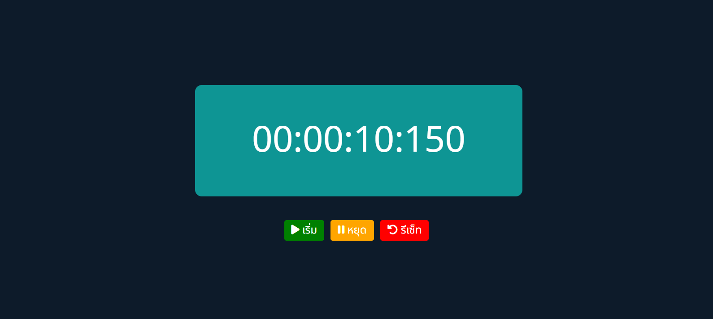

# Stop-Watch

This JavaScript code is utilized to create a timer with start, pause, and reset functionalities, displaying the elapsed time in the format "Hours:minutes:seconds:milliseconds" on a web page.

Key components of the code include:

1. Variables such as timeEl, startBtn, pauseBtn, and resetBtn, storing references to HTML elements based on their specified class.

2. Variables (milliseconds, seconds, minutes, and hours) holding values for each unit of time.

3. The timer variable, storing the setInterval ID, enabling the cessation of setInterval via clearInterval.

4. Functions like startTimer, pauseTimer, and resetTimer, triggered upon user clicks on the "Start," "Pause," and "Reset" buttons, respectively.

5. The displayTime function, invoked every 10 milliseconds, increments the milliseconds and updates the time in the correct format.

6. The updateDisplay function is used to modify the HTML content of the element with the class "time," displaying the timer results.

7. The formatTimeUnit function is employed to format each time unit, adding a leading zero if necessary.

In summary, this code serves as an illustration of using JavaScript to implement a straightforward timer on a web page.

Links Solution URL: [https://github.com/hedisnice/Stop-Watch]

Live Site URL: [https://hedisnice.github.io/Stop-Watch/]
